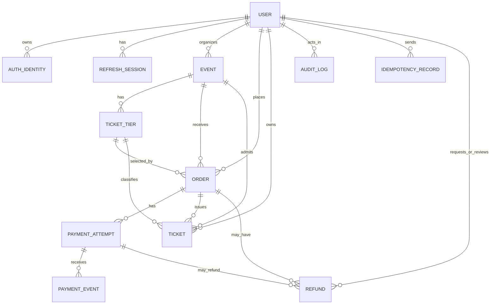

# EventGate entity relationship design

## Core relationships

- A user organizes zero or more events and places zero or more orders.
- An event has ticket tiers. An order selects exactly one tier from one event and stores immutable price/name snapshots.
- A paid order issues one ticket per requested unit. Every ticket has one owner, one tier, one event, and a unique QR token.
- Payment attempts are sequential for an order. Provider callback records are retained separately from the attempt so duplicate or malformed callbacks remain auditable.
- A refund always concerns one order and may target one payment attempt when resolving a late or duplicate payment.
- Audit logs, idempotency records, and durable jobs preserve operational evidence without deleting financial history.

## Lock order

Future inventory, payment, refund, and check-in services must lock resources in this order: `Event -> TicketTier -> Order -> PaymentAttempt/Refund -> Ticket`. This single order is documented now to reduce avoidable deadlocks when concurrent workflow services are added.
